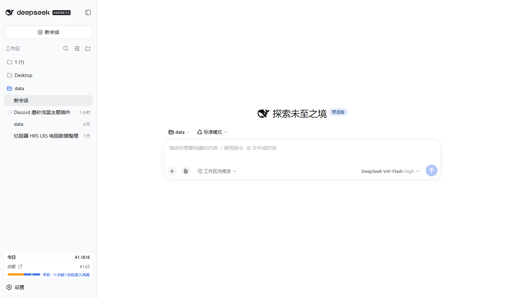
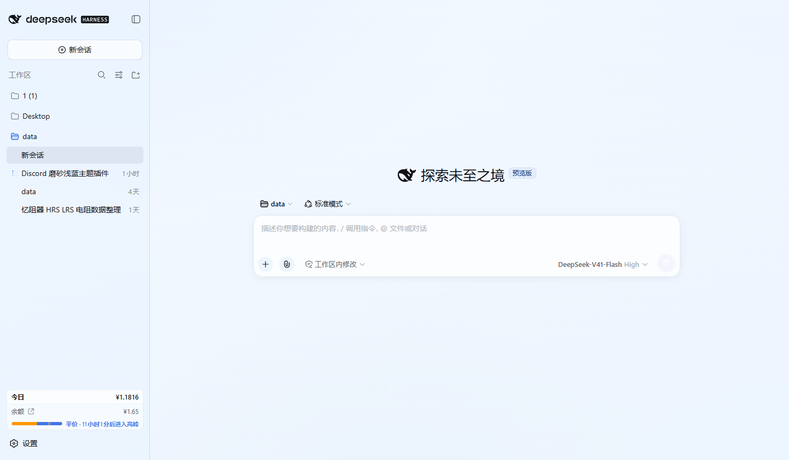
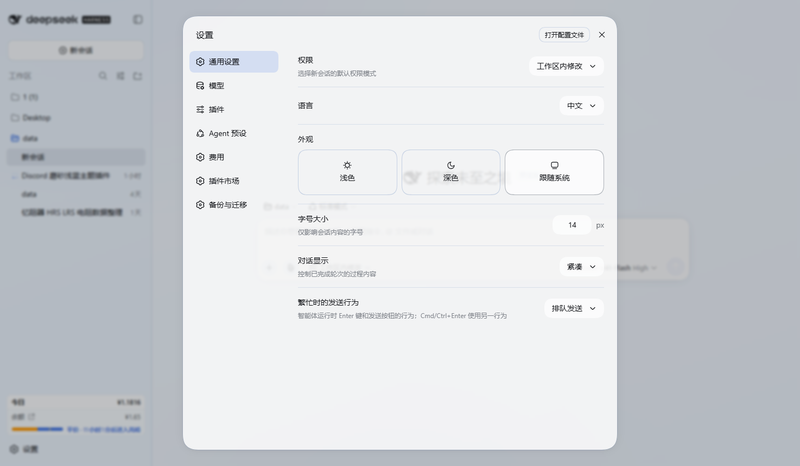

# dsh-frost-ice

DSH Web GUI 皮肤：**极淡冰蓝磨砂玻璃（frosted / acrylic）**。正文颜色一个字没动，仍然是 DSH 原本的近黑 `--dsw-alias-label-primary`（`#0f1115`），所以阅读体验和原版一致；变的只有背景透明度、描边色和浮层的 `backdrop-filter` 模糊。

下面三张都是**真实 DSH 界面**的截图（不是仿真稿）：用无头 Edge 打开本地 DSH、注入皮肤后截图，脚本在 `tools/shot.mjs`。

| 原版 | 装了皮肤 |
|---|---|
|  |  |

**设置对话框**（浮层磨砂正好能看出来）：



---

## 安装

包没有任何构建步骤、没有第三方依赖，`client/client.js` 就是最终产物。

### 方式 A：图形界面一键装（插件市场）

市场只从线上目录（`awesome-dsh-plugin.com`）安装，所以**得先发布**：

1. 发到 npm：`npm publish`（包名 `dsh-frost-ice`）；
2. 推一个 GitHub 仓库，带上 `real-skinned.png` / `real-settings.png`；
3. 往 `awesome-dsh-plugin/awesome-dsh-plugin` 提一条 `theme` 分类的条目（PR），字段就这几项：

```json
{
  "name": "dsh-frost-ice",
  "owner": "dogbotowo-oss",
  "url": "https://github.com/dogbotowo-oss/dsh-frost-ice",
  "category": "theme",
  "description": {
    "en": "Frosted ice-blue glass skin for the DSH Web GUI: translucent panels with backdrop blur over an ice-blue gradient, while body text stays the stock near-black #0f1115 for unchanged readability.",
    "zh": "DSH Web GUI 的冰蓝磨砂玻璃皮肤：面板半透明加 backdrop blur，压在冰蓝渐变上；正文保持原版近黑 #0f1115，可读性不变。"
  },
  "npm": "dsh-frost-ice",
  "install": "dsh plugin --profile web add dsh-frost-ice",
  "screenshots": [
    "https://raw.githubusercontent.com/dogbotowo-oss/dsh-frost-ice/HEAD/real-skinned.png",
    "https://raw.githubusercontent.com/dogbotowo-oss/dsh-frost-ice/HEAD/real-settings.png"
  ]
}
```

收录后在 **设置 → 插件市场** 搜 "frost" / "磨砂" 就能一键装。本包的 `package.json` 里也已经写好 `dshhub` 元数据块。

### 方式 B：本地目录（想马上看效果）

市场的图形界面只从目录装插件，**没有"从任意文件夹加载"的入口**（那等于任意代码执行）。所以本地未发布的版本只有一条路：

```sh
dsh plugin --profile web add file:<这个目录的绝对路径>
```

然后重启 DSH（桌面端退出重进），刷新页面。

### 方式 C：手工挂进 profile

1. 把整个目录拷到 `$DSH_HOME/profiles/web/node_modules/dsh-frost-ice`；
2. `$DSH_HOME/profiles/web/package.json` 的 `dsh.profile.bundles` 里加 `"dsh-frost-ice"`；
3. `$DSH_HOME/profiles/web/cordis.patch.yml` 里加：

```yaml
- insert:
    - id: dsh-frost-ice
      name: 'dsh-frost-ice'
```

4. 重启。方式 B / C 都会改 `~/.dsh`，建议先用 config-manager 导一份快照。

### 验证与卸载

打开页面按 F12，Console 里应该有一行 `[dsh-frost-ice] 冰蓝磨砂皮肤已生效。`，并且 `__dshFrostIce` 对象存在。卸载后 token 覆盖层、样式表、body 与浮层标记全部回收。

---

## 实现方式（以及踩到的三个坑）

**为什么不用 `ctx.theme.register`。** 内置的外观选择器（设置 → 通用 → 外观）写死了 light / dark / system 三格，注册进去的第三方主题 id **没有任何 UI 入口能选中**。所以改用 `ctx.theme.overrideTokens(source, tokens)`：把一层 token 覆盖叠在当前主题之上，装上即生效、卸载自动还原。

三个坑都是实测出来的，值得写下来：

**一、必须同时覆盖两个 token 家族。** `frame` 用的是 `--dsw-alias-bg-base`，但**侧栏用的是 `--dsw-specific-sidebar-fill`**。只覆盖 alias 的话侧栏保持原本的实心 `#f9fafb`，磨砂只能做一半。现在 43 个 token 里两个家族都覆盖了。

**二、`[class*="menu"]` 这种子串匹配会把整个界面糊死。** DSH 的样式是 CSS Module，真实类名长 `pI_x6G_frame`、`hHd-Xa_root` 这样带哈希；子串匹配会命中祖先容器，blur 一层层叠加，第一版效果图是**整页糊成一团**。现在浮层靠运行时判据标记（定位、z-index、面积、背景透明度），不用类名猜，契约测试里有一条断言禁止出现 `[class*=]`。

**三、模态面板的背景是写死的 `rgb(255,255,255)`，不走任何 token。** 光靠 token 覆盖不可能让它变透明，模糊也就无从谈起。所以对 `role="dialog"` 和 `--dsh-overlay-layer` 的子元素显式放开背景透明度（`color-mix`，旧引擎走 `@supports not` 兜底）。

**可读性是当成硬约束守的。** 覆盖层一个 `--dsw-alias-label-*` / `--dsw-alias-link` 都没碰，也没有动 `--dsw-static-*` 调色板。`test/contract.test.mjs` 里有专门断言守这条线。

---

## 已知限制

- **同时作用于 light 和 dark 两种偏好。** 外观选择器没有第四个格子让你单独切这个皮肤，而 `overrideTokens` 的每一层又必须同时给 light/dark 两个值（只给一个，切到另一个配色就不可读）。取舍是两种模式给同一套"永远浅色磨砂"的值，保证不出现深底配深字。要把 dark 偏好改成不做任何覆盖，把 `TOKENS` 里各 token 的 `dark` 值换回原版即可。
- **主体玻璃感偏克制。** 这版把冷色集中在上缘与两角、中部留白，保证对话区长文本落在最亮的地方。想要更蓝，改 `client/client.js` 里 `html:has(body[data-dsh-frost-ice])` 的那几条 `radial-gradient` 色值。
- **个别区域可能仍是死白。** 如果某个容器背景写死且不走 token，它不会变透明。Console 里跑 `__dshFrostIce.inspect()`：`opaque` 表列出"面积大于 240×160 却仍完全不透明"的容器，拿它的选择器补一条规则即可。
- `backdrop-filter` 有大面积 GPU 成本，低端显卡上若掉帧，把模糊半径从 `18px/20px` 调小。
- 只对 Web GUI 生效，终端 TUI 不在范围内。

**无障碍：** 不支持 `backdrop-filter` 的引擎走 `@supports not` 分支退回更实的玻璃；系统开启「减少透明度」时走 `prefers-reduced-transparency: reduce` 分支全部退回纯白不透明。

---

## 目录结构

```
dsh-frost-ice/
├── package.json            # dsh.client 声明（platform: web，无构建步骤）+ dshhub 元数据
├── client/client.js        # 全部实现：token 覆盖层 + 样式表 + 浮层标记 + 排查助手
├── preview.html            # 离线预览，左右同屏对比原版与皮肤，不需要装 DSH
├── preview.png             # 上面那个预览的渲染图
├── real-default.png        # 真实 DSH 界面·原版
├── real-skinned.png        # 真实 DSH 界面·冰蓝磨砂
├── real-settings.png       # 真实 DSH 界面·设置对话框（浮层磨砂）
├── test/contract.test.mjs  # 契约测试（node test/contract.test.mjs）
└── tools/
    ├── cdp.mjs             # 共用：无头 Edge + 按 DSH 规则签浏览器会话 cookie
    ├── shot.mjs            # 出上面三张真实界面图
    └── probe-overlay.mjs   # 探真实 DOM / 浮层结构，改选择器时用
```

`tools/*` 和 `real-*.png` 只是开发期的验证工具与产物，插件运行不需要它们。工具全程只读 `~/.dsh`（只读 `.credentials.yaml` 里的 browser-session secret 来签会话 cookie），不装插件、不改 profile。

## 改配色

颜色全在 `client/client.js` 的 `TOKENS` 与 `CSS` 里，改完不用构建，重启 DSH 即可。`preview.html` 里有一份同步的 CSS 拷贝——改了 `client.js` 记得同步，否则离线预览会和实际不一致。
